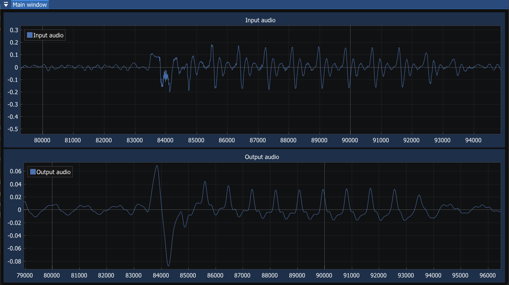

# DSP Plotter

This is a tool used for quick plotting of DSP algorithms. It is written in C++ as a library with a C API for easy use in C or C++ projects. You just provide the startup, process, and shutdown functions for your algorithm, along with the path to a .wav file. The tool will load the file, process it through your algorithm, and display the input and output waveforms on a nice-looking plot.



## How to use
1) Pull in DSP Plotter to your project as submodule with 
```
git submodule add https://github.com/lucasburkholder/dsp-plotter.git <plotter_dir>
```

2) Add these lines to `CMakeLists.txt`. `<main_target_name>` should be an executable, and `<plotter_dir>` should be the directory into which you cloned this repository as a submodule in step 1.

```
add_subdirectory(<plotter_dir>)
target_link_libraries(<main_target_name> dsp-plotter)
```

3) In main source code, `#include "dsp-plotter.h"`.

4) Call `DspPlotter_init()`, passing in audio file, frame size, and pointers to processing functions.

5) Call `DspPlotter_show()` to show the window.

That's it! When you build and run executable `<main_target_name>`, the plot should pop up showing your input and output data.

## Credits
- Wav files: [TinyWav](https://github.com/mhroth/tinywav)
- GUI: [Dear ImGui](https://github.com/ocornut/imgui)
- Plotting: [ImPlot](https://github.com/epezent/implot)
- Window: [GLFW](https://www.glfw.org/)